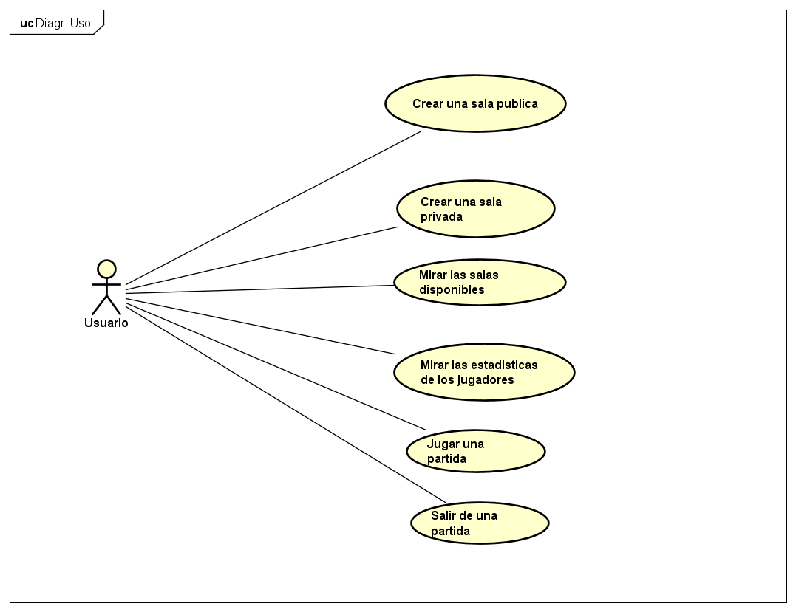
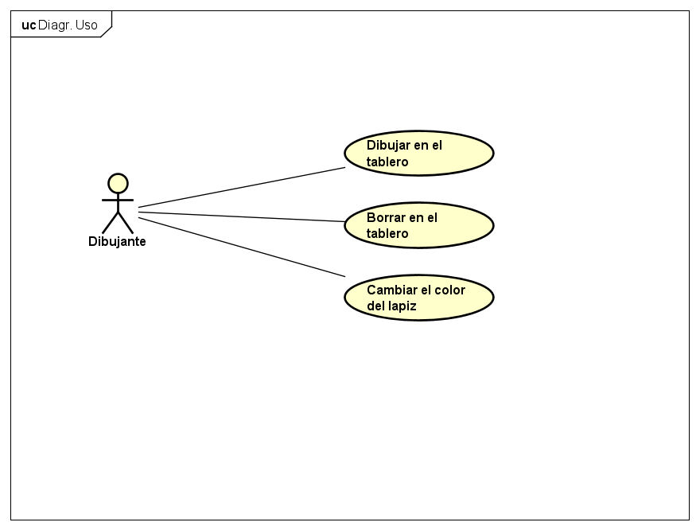
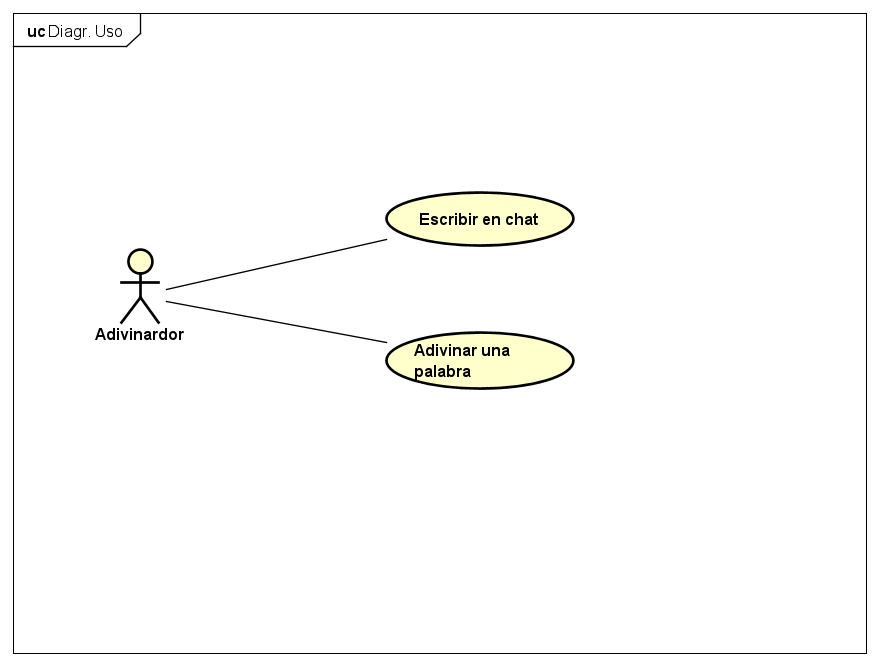
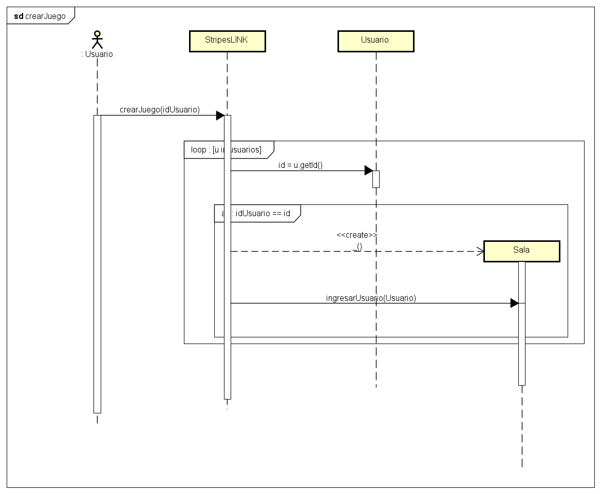
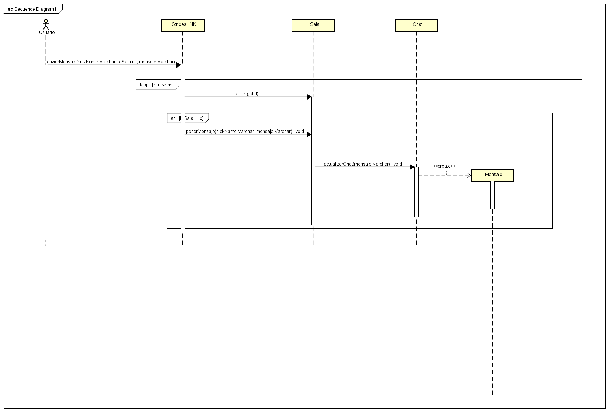
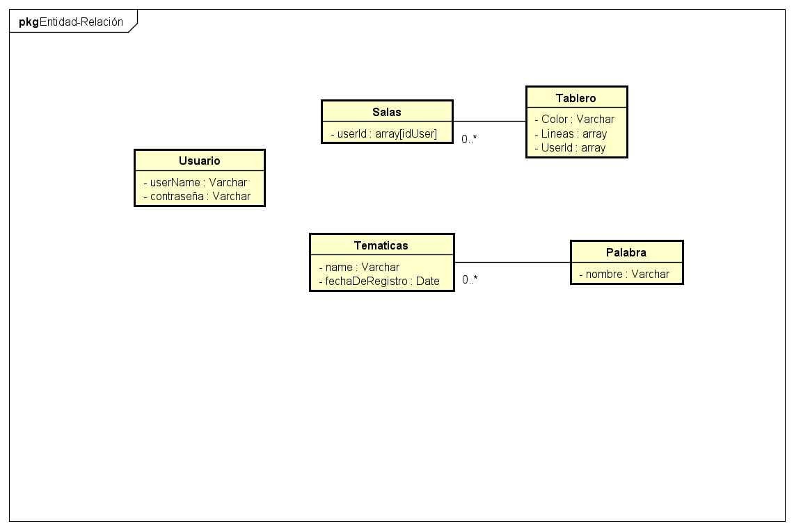
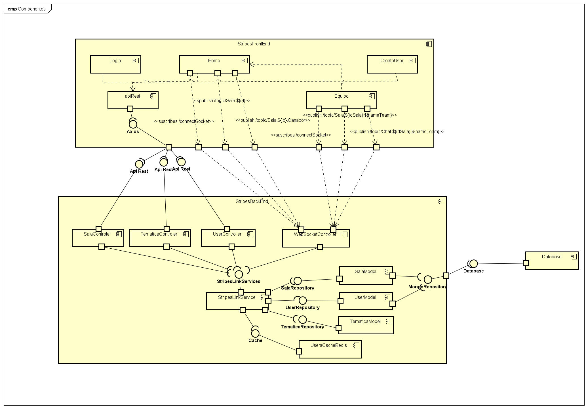

# StripesLink 

 ## Asignatura
	Arquitecturas de software (ARSW) 2020-2

 ## Descripción
StripesLink es un juego basado en la idea clásica de punturillo2 con unas variaciones. El juego consiste en la formación de 2 equipos las cuales están conformados en su totalidad por mínimo 4 jugadores por partida. estos se dividen el rol y las responsabilidades de dibujar y adivinar una palabra. El equipo que adivine primero la palabra que se esta dibujando en pantalla. Gana La Ronda.

 ## Manual de Usuario
Para ver el manual de uso clickee la siguiente imagen

## Casos de uso

## Diagrama de clases

## Diagramas de secuencia

## Diagrama de paquetes

## Diagrama entidad relacion

## Diagrama de componentes

## Diagrama de despliegue

## Autores
* **Johann Steven Bogotá Vélez**  - Escuela Colombiana de Ingeniería Julio Garavito
* **Steven Garzon Reina**  - Escuela Colombiana de Ingeniería Julio Garavito
* **Johan Stiven Guerrero Pineda** - Escuela Colombiana de Ingeniería Julio Garavito

